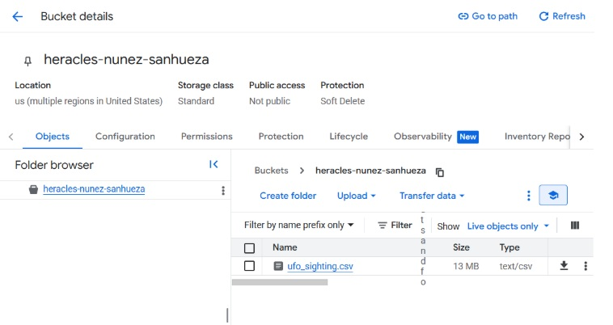
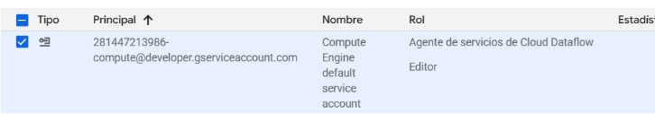
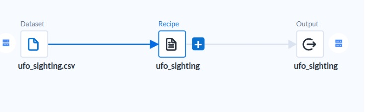
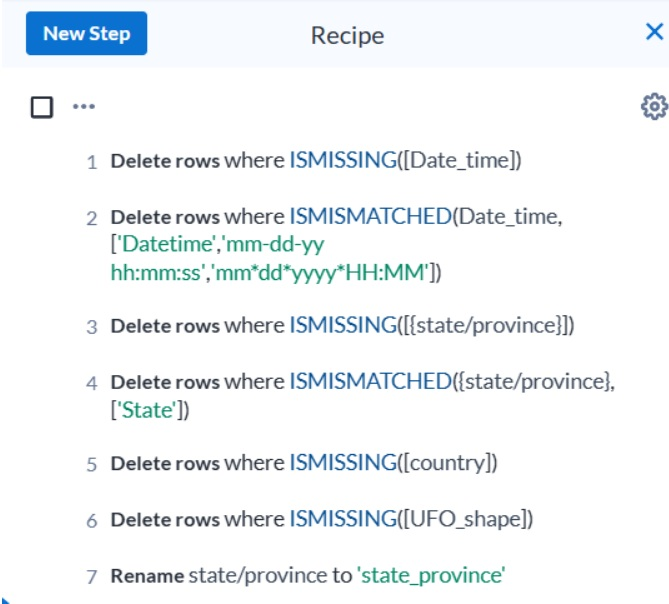
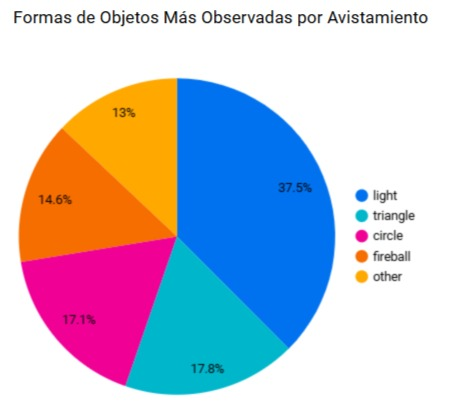

# Evaluación 2 Big Data: Avistamientos OVNI
**Integrantes:**  
- Liliana Heracles  
- Lidia Nuñez  
- Diego Sanhueza

**Profesor:** Fernando Fuentes  
**Sección:** 002D  

## Tabla de Contenidos

- [Introducción](#introducción)
- [Objetivo del Proyecto](#objetivo-del-proyecto)
- [Metodología](#metodología)
- [Consultas SQL destacadas](#consultas-sql-destacadas)
- [Gráficos con Looker Studio](#gráficos-con-looker-studio)
- [Resultados e insights](#resultados-e-insights)
- [Conclusión](#conclusión)
- [Anexos](#anexos)

## Introducción
El presente informe tiene como objetivo presentar el desarrollo de un proceso completo de análisis de datos en un entorno Big Data, utilizando herramientas del ecosistema de Google Cloud. La actividad se enmarca en la Evaluación Parcial N°2 del curso Big Data (AVY1101), y consiste en la construcción de un flujo de trabajo que permita la ingesta, limpieza, transformación, análisis y visualización de grandes volúmenes de datos mediante procesos batch.

Para este propósito, se utilizó un archivo con registros históricos de avistamientos de objetos voladores no identificados (OVNIs), el cual fue cargado inicialmente en Cloud Storage como parte del diseño de un Data Lake. Posteriormente, el conjunto de datos fue procesado mediante Cloud Dataprep (Alteryxs), donde se llevaron a cabo tareas de limpieza y preparación de datos para asegurar su calidad. Una vez procesado, el archivo fue cargado en una tabla del servicio BigQuery, lo que permitió ejecutar diversas consultas SQL para obtener insights relevantes.

Finalmente, se construyeron visualizaciones interactivas en Looker Studio, enfocadas en responder preguntas de negocio relacionadas con la frecuencia, ubicación y características de los avistamientos registrados. Este informe documenta cada una de las etapas del proceso, incluyendo capturas, consultas y análisis obtenidos, evidenciando el desarrollo de competencias clave en el manejo de tecnologías de Big Data.

## Objetivo del Proyecto

El objetivo principal del proyecto es diseñar y ejecutar un proceso completo de análisis de datos en un entorno Big Data, utilizando herramientas de Google Cloud Platform, con el fin de gestionar, transformar y visualizar información proveniente de un conjunto de datos sobre avistamientos de OVNIs.

## Metodología
El taller es realizado en la plataforma `Google Skill Boost`, exactamente en el `Lab GSP823`, en el cual se accede con el usuario y contraseña. Esto lleva directo al launcher del taller a realizar, en él es necesario crear un bucket, de la siguiente forma:
```
Cloud Storage -> Buckets -> Create
   ```
En el cual se crea al bucket necesario para cargar el archivo Excel (.csv) para la extracción de datos, el bucket creado tiene como nombre, el apellido de todos los integrantes del grupo de la siguiente forma:



El conjunto de datos utilizados para este proyecto corresponde a un archivo denominado ufo_sighting.csv, el cual contiene registros históricos de avistamientos de objetos voladores no identificados (OVNIs). Este dataset incluye información relevante como fecha y hora del evento (Date_time), ubicación (city, state/province, country), características del objeto (UFO_shape), duración estimada del encuentro, descripción del suceso, y coordenadas geográficas (latitude y longitude), entre otros campos.

Es necesario otorgar el rol de `Agente de Servicios de Cloud Dataflow`, o bien, `Cloud Dataflow Service Agent` para poder realizar las consultas en Alterxys:



Se procede a cargar la base de datos de nombre `ovni` en la Big Query, en la cuál se cargará la posterior tabla a crear, por tanto, se accede a la Big Query y se crea de de la siguiente manera:
```
Big Query -> Se busca el nombre del laboratorio -> Se seleccionan (⋮) -> Create Dataset -> Y se elige el nombre de ovni
   ```

Posteriormente, se conecta este archivo desde la herramienta Cloud Dataprep (Alteryxs) , con el objetivo de revisar y preparar los datos antes de su análisis. Esta conexión facilitó el acceso al contenido del archivo para su posterior limpieza, validación y transformación, como parte del proceso de preparación de datos batch previo a su carga en BigQuery. 

Luego de creado el flujo de datos, se procede a cargar la base de datos de la siguiente forma:

```
Connect to your Data -> Import DataSet -> Cloud Storage -> Bucket -> ufo_sighting.csv -> Import & Add DataFlow
   ```

Se crea la siguiente vista:



Se elige el `recipe`, dentro de esto, se realiza la limpieza de la tabla cargada, se puede observar que presenta valores en gris que son lo valores nulos dentro de la columna y los cuales se pueden omitir sin perder la información necesaria a manejar y por otro lado, se tienen los valores presentados en rojo, que son valores inconsistentes o pérdidos dentro de las columnas. La limpieza realizada para poder evaluar los datos se hace de la siguiente forma:



Se eliminan los valores nulos dentro de las columnas  `Date_time`,  `state/province`,  `country`,  `UFO_shape`. También, se observa que se cambia el nombre de la columna state/province por  `state_province`, esto con el fin de no generar errores al momento de la creación de la tabla avistamientos.

Siguiendo con esto, se procede a ejecutar la cración de la tabla `avistamientos` de la siguiente manera:
```
Run -> En Actions en Create-CSV -> Edit -> Big Query -> ovni -> Create a new table -> Se escoge el nombre de la tabla como "avistamientos"
   ```

Una vez creada la tabla, es necesario volver al launcher de Cloud Boost Skill para comenzar las consultas necesarias. Dentro de la sección Big Query y en el lab creado, se puede observar que en la base de datos `ovni`, está la reciente tabla creada `avistamientos`, en la cuál se procede a realizar las consultas de SQL para el analisis de datos.

## Consultas SQL destacadas
 ```
SELECT 
  UFO_shape,
  COUNT(*) AS Sightings
FROM 
  `nombre del laboratorio`
WHERE 
  country = 'us'
GROUP BY 
  UFO_shape
ORDER BY 
  Sightings DESC
LIMIT 5;
 ```

 ```
SELECT 
  EXTRACT(YEAR FROM DATETIME(Date_time)) AS Year,
  COUNT(*) AS Sightings
FROM 
  `nombre del laboratorio`
WHERE 
  country = 'us'
GROUP BY 
  Year
ORDER BY 
  Sightings DESC;
 ```
 ```
 SELECT 
  `city` AS City,
  COUNT(*) AS Sightings
FROM 
  `nombre del laboratorio`
WHERE 
  country = 'us'
GROUP BY 
  City
ORDER BY 
  Sightings DESC;
```
## Resultados 

Dentro de las consultas destacadas, se pueden extraer los siguientes gráficos:

# Formas de los Objetos más vistos en avistamientos

Este gráfico de torta representa las cinco formas más comunes de objetos voladores no identificados reportadas en Estados Unidos. Se observa que las formas "light" y "circle" lideran los reportes.




## Gráficos con Looker Studio

...

## Conclusión

...

## Anexos

...


[](https://github.com/pages-themes/minimal/actions/workflows/ci.yaml) [](https://badge.fury.io/rb/jekyll-theme-minimal)

*Minimal is a Jekyll theme for GitHub Pages. You can [preview the theme to see what it looks like](http://pages-themes.github.io/minimal), or even [use it today](#usage).*


## Usage

To use the Minimal theme:
